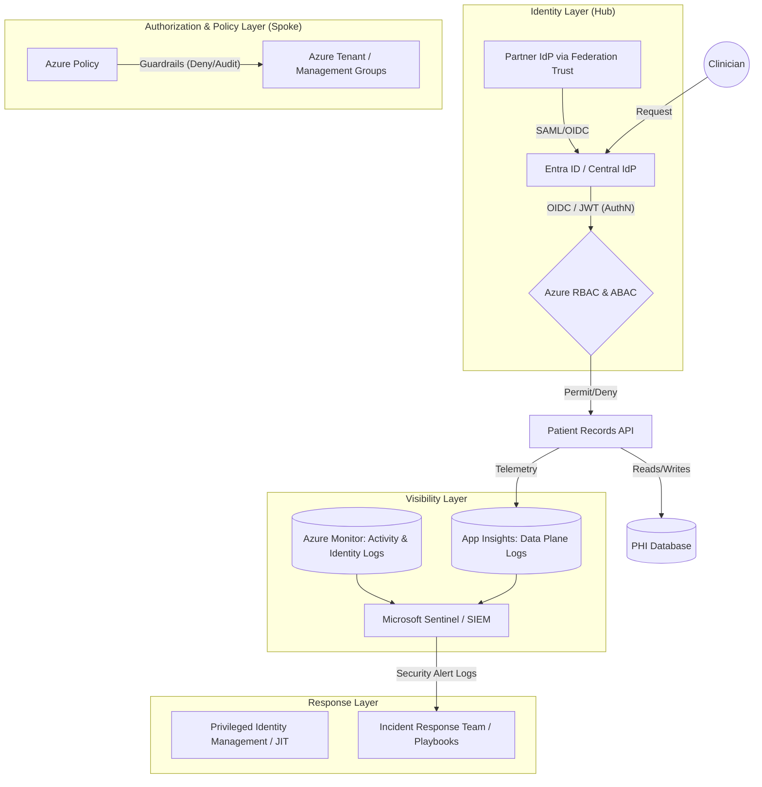

# CST8919 - A10: Secure Infrastructure Proposal 

### Part A: Architecture Diagram

---

### Part B — Compliance Mapping Table

[cite_start]The goal of this table is to map compliance requirements to specific technical controls and the audit-ready evidence they produce[cite: 481]. 

| Compliance Requirement                               | Technical Control                                                                                                                                  | Tool                                                                                         | Evidence Source                                                                                              |
| :--------------------------------------------------- | :------------------------------------------------------------------------------------------------------------------------------------------------- | :------------------------------------------------------------------------------------------- | :----------------------------------------------------------------------------------------------------------- |
| **Restrict access to authorized personnel only**     | [cite_start]Implement least privilege using short-lived credentials tied to identity, enforced via Just-In-Time (JIT) access[cite: 183, 273, 449]. | [cite_start]Entra ID / Privileged Identity Management (PIM)[cite: 273].                      | [cite_start]Identity logs (sign-in logs) detailing authentication events[cite: 382, 383].                    |
| **Maintain audit trails for 1 year**                 | [cite_start]Route logs to immutable storage, limiting who can touch the source of evidence to prevent tampering[cite: 512].                        | [cite_start]Azure Storage with Resource Locks[cite: 402, 509].                               | [cite_start]Storage account configuration and Control Plane (ARM) logs[cite: 370, 371].                      |
| **Block non-compliant resources (e.g., Public DBs)** | [cite_start]Deploy preventative controls to block non-compliant actions before they happen[cite: 482, 483].                                        | [cite_start]Azure Policy (Deny Mode) deployed at the Management Group level[cite: 507, 508]. | Azure Policy evaluation logs and rejected ARM deployment requests.                                           |
| **Detect and respond to security incidents**         | [cite_start]Utilize detective controls to identify violations [cite: 488, 489] and correlate events across infrastructure and applications.        | [cite_start]Microsoft Sentinel / Azure Monitor[cite: 389, 490].                              | [cite_start]Processed Events / Security alert logs and incident timelines normalized to UTC[cite: 385, 575]. |
| **Ensure accountability for administrative actions** | [cite_start]Track all resource creation, deletion, and changes (CRUD operations)[cite: 370, 371].                                                  | [cite_start]Azure Activity Logs / ARM Logs[cite: 371].                                       | [cite_start]Audit logs detailing the caller, operation, and timestamps[cite: 455].                           |

---

### Part C — Incident Response Outline

**Scenario:** Compromised clinician credential — bulk PHI export.
A valid session token is stolen and used to call the patient-records API in bulk. [cite_start]The attacker "needles away at privileges" below alert thresholds to remain stealthy[cite: 538]. [cite_start]The industry mean time to detect (MTTD) is 220 days[cite: 537, 562]; our architecture aims to detect this in minutes via behavioral anomalies.

* [cite_start]**Detection:** * Microsoft Sentinel triggers a security alert [cite: 490] based on an anomaly: a known identity is requesting abnormal volumes of data outside of regular shifts. 
    * We establish the timeline by asking: What triggered the alert? Is the source IP known? [cite_start]What else did this identity access (blast radius)?[cite: 568, 570, 571].
* [cite_start]**Evidence:** * Collect identity logs (Entra ID) to review the AuthN process and verify if MFA was satisfied[cite: 382, 383].
    * [cite_start]Collect application logs (App Insights) to determine exactly which patient records were accessed[cite: 379, 380].
    * [cite_start]Normalize all timestamps to UTC to build a chronological timeline[cite: 575, 576].
* [cite_start]**Containment:** * We follow the principle of containment without evidence destruction[cite: 579]. [cite_start]Deleting the compromised resource destroys forensic evidence[cite: 580, 581].
    * [cite_start]Immediate actions: Revoke the session token, isolate the resource via network rules, and capture a snapshot/image of the system state before any further remediation[cite: 582, 583].
    * [cite_start]All containment actions are logged to join the incident record[cite: 584].
* [cite_start]**Remediation:** * Conduct a root cause analysis to determine how the credential was compromised[cite: 541, 594].
    * [cite_start]To prevent recurrence, update policies and run regular tabletop exercises to test decision-making and ensure the team knows escalation paths and log access procedures[cite: 599, 602, 603].

---

### Key Design Decisions and Tradeoffs

[cite_start]**Identity as the New Perimeter:** The architecture assumes the network is breached and forces authentication (AuthN) and authorization (AuthZ) on every request[cite: 181, 182, 196]. [cite_start]We utilize OpenID Connect (OIDC) and JSON Web Tokens (JWTs) for cloud-native, lightweight authentication [cite: 105, 106, 110][cite_start], avoiding older, inflexible protocols like SAML where possible[cite: 104, 221]. [cite_start]Because JWTs cannot be revoked once issued, we rely on Just-In-Time (JIT) access and short-lived tokens to mitigate risk[cite: 246, 255]. [cite_start]Entra ID serves as the central hub, federating enterprise customer IdPs to ensure tenant isolation while allowing unilateral trust revocation[cite: 113, 120, 133]. 

[cite_start]**Guardrails over Gates:** Gates (like change approval boards) block progress and slow delivery[cite: 494, 498]. [cite_start]We opted for Guardrails (Azure Policy in deny mode) because they protect delivery and scale with automated pipelines[cite: 497, 498]. [cite_start]Developers can deploy anything *except* specific violations[cite: 496]. 

[cite_start]**Audit Mode before Deny Mode:** Policies fail when they are too broad, blocking legitimate work and forcing teams to bypass security entirely[cite: 523, 527]. [cite_start]To prevent this, all new policies are first deployed in "Audit" mode to detect non-compliant resources without breaking critical workflows, moving to "Deny" mode only after validation[cite: 507, 518, 519, 525]. 

[cite_start]**Visibility over Assumptions:** A major cause of ignored breaches is disabling logs to save costs or setting retention times too short[cite: 191, 192]. [cite_start]Visibility is always limited by what you choose to log[cite: 367]. [cite_start]We prioritized comprehensive logging across the control plane, data plane, and identity services, recognizing that audit trails are the foundation for detection and compliance[cite: 338, 339, 370, 373, 382].

**Reflection — Tradeoffs and What's Next:**
The sharpest tension is between security rigor and development velocity. Azure Policy in deny mode prevents misconfigurations but can slow experimentation. The mitigation is a dedicated sandbox subscription under a less-restrictive management group. 

Cost versus coverage is the second tradeoff. A full 24/7 SOC is often out of reach for a mid-sized company. [cite_start]We mitigate this by relying on Microsoft Sentinel's automated security alerts[cite: 385]. With more budget, I would implement regularly scheduled tabletop exercises. [cite_start]These simulated incidents reveal operational gaps—such as who lacks log access or doesn't know the escalation path—before a real crisis occurs[cite: 600, 602, 603].