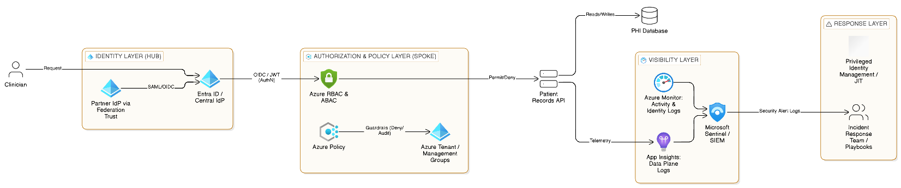

# CST8919 - A10: Secure Infrastructure Proposal 

### Part A: Architecture Diagram

---

### Part B: Compliance Mapping Table

This table maps compliance requirements to specific technical controls and the evidence they produce for auditing purposes. 

| Compliance Requirement                               | Technical Control                                                                                                 | Tool                                                             | Evidence Source                                                                  |
| :--------------------------------------------------- | :---------------------------------------------------------------------------------------------------------------- | :--------------------------------------------------------------- | :------------------------------------------------------------------------------- |
| **Restrict access to authorized personnel only**     | Implement least privilege using short-lived credentials tied to identity, enforced via Just-In-Time (JIT) access. | Entra ID / Privileged Identity Management (PIM).                 | Identity logs (sign-in logs) detailing authentication events.                    |
| **Maintain audit trails for 1 year**                 | Route logs to immutable storage, limiting who can touch the source of evidence to prevent tampering.              | Azure Storage with Resource Locks.                               | Storage account configuration and Control Plane (ARM) logs.                      |
| **Block non-compliant resources (e.g., Public DBs)** | Deploy preventative controls to block non-compliant actions before they happen.                                   | Azure Policy (Deny Mode) deployed at the Management Group level. | Azure Policy evaluation logs and rejected ARM deployment requests.               |
| **Detect and respond to security incidents**         | Utilize detective controls to identify violations  and correlate events across infrastructure and applications.   | Microsoft Sentinel / Azure Monitor.                              | Processed Events / Security alert logs and incident timelines normalized to UTC. |
| **Ensure accountability for administrative actions** | Track all resource creation, deletion, and changes (CRUD operations).                                             | Azure Activity Logs / ARM Logs.                                  | Audit logs detailing the caller, operation, and timestamps.                      |

---

### Part C: Incident Response Outline

**Scenario:** Compromised clinician credential: bulk PHI export.
A valid session token is stolen and used to call the patient-records API in bulk. The attacker "needles away at privileges" below alert thresholds to remain stealthy. The industry mean time to detect (MTTD) is 220 days; our architecture aims to detect this in minutes via behavioral anomalies.

* **Detection:** * Microsoft Sentinel triggers a security alert  based on an anomaly: a known identity is requesting abnormal volumes of data outside of regular shifts. 
    * I establish the timeline by asking: What triggered the alert? Is the source IP known? What else did this identity access (blast radius)?.
* **Evidence:** * Collect identity logs (Entra ID) to review the AuthN process and verify if MFA was satisfied.
    * Collect application logs (App Insights) to determine exactly which patient records Ire accessed.
    * Normalize all timestamps to UTC to build a chronological timeline.
* **Containment:** * I follow the principle of containment without evidence destruction. Deleting the compromised resource destroys forensic evidence.
    * Immediate actions: Revoke the session token, isolate the resource via network rules, and capture a snapshot/image of the system state before any further remediation.
    * All containment actions are logged to join the incident record.
* **Remediation:** * Conduct a root cause analysis to determine how the credential was compromised.
    * To prevent recurrence, update policies and run regular tabletop exercises to test decision-making and ensure the team knows escalation paths and log access procedures.

---

### Key Design Decisions and Tradeoffs

**Identity as the New Perimeter:** The architecture assumes the network is breached and forces authentication (AuthN) and authorization (AuthZ) on every request. I utilize OpenID Connect (OIDC) and JSON Ib Tokens (JWTs) for cloud-native, lightIight authentication , avoiding older, inflexible protocols like SAML where possible. Because JWTs cannot be revoked once issued, I rely on Just-In-Time (JIT) access and short-lived tokens to mitigate risk. Entra ID serves as the central hub, federating enterprise customer IdPs to ensure tenant isolation while allowing unilateral trust revocation. 

**Guardrails over Gates:** Gates (like change approval boards) block progress and slow delivery. I opted for Guardrails (Azure Policy in deny mode) because they protect delivery and scale with automated pipelines. Developers can deploy anything *except* specific violations. 

**Audit Mode before Deny Mode:** Policies fail when they are too broad, blocking legitimate work and forcing teams to bypass security entirely. To prevent this, all new policies are first deployed in "Audit" mode to detect non-compliant resources without breaking critical workflows, moving to "Deny" mode only after validation. 

**Visibility over Assumptions:** A major cause of ignored breaches is disabling logs to save costs or setting retention times too short. Visibility is always limited by what you choose to log. I prioritized comprehensive logging across the control plane, data plane, and identity services, recognizing that audit trails are the foundation for detection and compliance.

**Reflection: Tradeoffs and What's Next:**
The sharpest tension is betIen security rigor and development velocity. Azure Policy in deny mode prevents misconfigurations but can slow experimentation. The mitigation is a dedicated sandbox subscription under a less-restrictive management group. 

Cost versus coverage is the second tradeoff. A full 24/7 SOC is often out of reach for a mid-sized company. I mitigate this by relying on Microsoft Sentinel's automated security alerts. With more budget, I would implement regularly scheduled tabletop exercises. These simulated incidents reveal operational gaps (such as who lacks log access or doesn't know the escalation path) before a real crisis occurs.