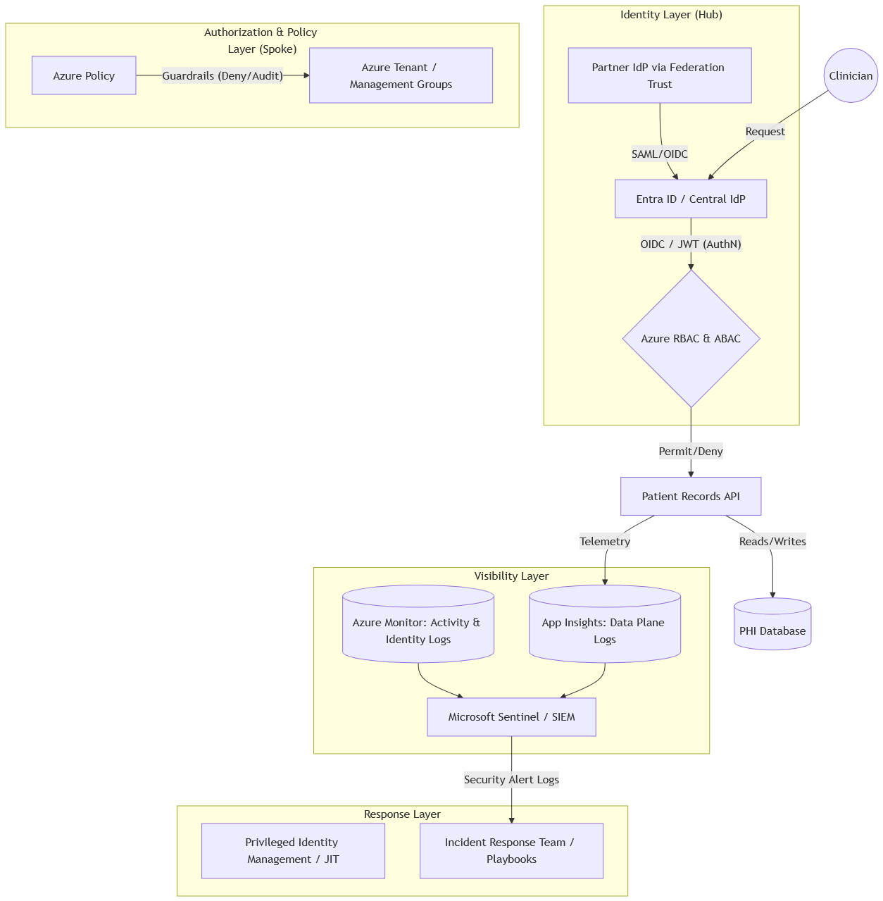

# CST8919 - A10: Secure Infrastructure Proposal 

## Part A: Architecture Diagram

This proposed architecture is for a mid-sized SaaS company expanding into the heavily regulated **healthcare** industry using Azure as their cloud platform of choice.

The architecture follows a **hub-and-spoke** identity model, treating identity as the new network perimeter. Rather than trusting the network, every request must prove who is making it and what they are allowed to do; AuthN then AuthZ, with clear visibility throughout.

### Identity Layer (Hub)

**Entra ID** acts as the central **Identity Provider**, the source for all authentication events. The client brings their own IdPs (hospital networks, clinic systems), which federate into Entra ID via explicit bilateral trust relationships using **SAML** or **OIDC**. We must consider integrating legacy systems that still rely on outdated yet enterprise SAML dependencies. Following lecture notes, OIDC is preferred for any new integrations since it is JSON/JWT-based, lightweight, and built on the OAuth 2.0 framework, avoiding the inflexibility and XML overhead of SAML. The federation trust is explicit and revocable unilaterally, which is critical in a healthcare tenant: if a partner organization is compromised or offboarded, trust can be severed immediately without touching any other tenant. The architecture also enforces tenant isolation where users from one enterprise customer must never see another customer's PHI, addressed through email domain mapping and tenant-specific login URLs at the IdP discovery layer.

### AuthZ & Policy Layer (Spoke)

After AuthN, Entra ID issues a signed JWT containing identity claims and role assignments in the payload. This token flows to the AuthZ layer, where **Azure RBAC and ABAC** evaluate whether the requesting identity is permitted to perform the requested action on the resource. As lecture notes highlight, authorization failures are the number one source of cloud security incidents. Misconfigured permissions are more dangerous than missing authentication. The architecture applies **least privilege** throughout: clinicians get the minimum permissions needed to read patient records for their assigned patients, with no standing access to bulk export endpoints.
**Azure Policy** is deployed in deny mode at the Management Group level, functioning as a guardrail rather than a gate. Gates block progress and slow delivery; guardrails prevent dangerous actions without blocking everything else. Developers can deploy any resource except specific violations (public databases, resources outside approved regions). All new policies are validated in audit mode first before promotion to deny mode, preventing the failure mode where overly broad policies force teams to bypass security entirely.

### Visibility Layer

The visibility layer is the foundation for detection and compliance. **Azure Monitor** collects control plane logs (**Activity Logs, ARM logs** tracking all CRUD operations) and feeds them to **Microsoft Sentinel**. **Application Insights** captures data plane telemetry from the Patient Records API/ Every request, response code, record ID accessed, and timestamp is logged here. As the lecture notes emphasize, visibility is always limited by what you choose to log, and ignored breaches are most commonly caused by logs being disabled to save costs or retention times set too short. This architecture prioritizes comprehensive logging: logs are routed to immutable **Azure Storage** with **Resource Locks** to prevent deletion or tampering, retained for one year to satisfy **HIPAA** audit requirements, and all timestamps are normalized to UTC.
Microsoft Sentinel aggregates both log streams and applies behavioral analytics, using its Fusion engine to correlate signals that would not trigger alerts individually to match to MITRE ATT&CK patterns.

### Response Layer

**Privileged Identity Management** enforces **JIT** access for any elevated roles. Because JWTs cannot be revoked once issued, the architecture relies on short-lived token lifetimes and JIT activation windows to limit the blast radius of a compromised credential. This will be crucial to the specific risk the following incident scenario exploits. The Incident Response team and playbooks receive security alert logs directly from Sentinel, enabling detection in minutes rather than the industry MTTD of 220 days that we discussed in class.

---

## Part B: Compliance Mapping Table

This table maps compliance requirements to specific technical controls and the evidence they produce for auditing purposes. 

| Compliance Requirement                                     | Technical Control                                                                                                 | Tool                                                             | Evidence Source                                                                |
| :--------------------------------------------------------- | :---------------------------------------------------------------------------------------------------------------- | :--------------------------------------------------------------- | :----------------------------------------------------------------------------- |
| **Restrict access to authorized personnel only**           | Implement least privilege using short-lived credentials tied to identity, enforced via Just-In-Time (JIT) access. | Entra ID/Privileged Identity Management (PIM).                   | Identity logs (sign-in logs) detailing authentication events.                  |
| **Maintain audit trails for 1 year**                       | Route logs to immutable storage, limiting who can touch the source of evidence to prevent tampering.              | Azure Storage with Resource Locks.                               | Storage account configuration and Control Plane (ARM) logs.                    |
| **Block non-compliant resources (ex., public access DBs)** | Deploy preventative controls to block non-compliant actions before they happen.                                   | Azure Policy (Deny Mode) deployed at the Management Group level. | Azure Policy evaluation logs and rejected ARM deployment requests.             |
| **Detect and respond to security incidents**               | Utilize detective controls to identify violations  and correlate events across infrastructure and applications.   | Microsoft Sentinel/Azure Monitor.                                | Processed Events/Security alert logs and incident timelines normalized to UTC. |
| **Ensure accountability for administrative actions**       | Track all resource creation, deletion, and changes (CRUD operations).                                             | Azure Activity Logs/ARM Logs.                                    | Audit logs detailing the caller, operation, and timestamps.                    |

---

## Part C: Incident Response Outline

### Scenario: Compromised clinician credential -> Bulk PHI export

A valid session token belonging to a clinician is stolen, likely via phishing or an unmanaged endpoint, and used to call the patient-records API outside of regular working hours. As often seen in these cases, the attacker moves deliberately below standard alert thresholds, paging through records incrementally rather than issuing a single large query. Thereby, the attacker demonstrates a technique sometimes called "low and slow" exfiltration. As we discussed in lecture, the industry mean time to detect (MTTD) for a credential compromise is approximately 220 days. Our architecture is designed to collapse that window to minutes by correlating behavioral signals rather than relying on any single threshold trigger.

### Detection

Microsoft Sentinel fires a Medium-High severity alert based on two correlated signals: an anomaly detection rule flagging that a known identity is requesting an abnormal volume of patient records (above clinician's 90-day baseline), and a second signal noting that the requests are originating from an IP address not previously associated with this user or tenant (based on the user's behavioral baseline). Neither signal alone would fire an alert; Sentinel's Fusion engine correlates both to produce a high-confidence incident.
The initial triage questions I establish to scope the incident are:

- What exactly triggered the alert? Which rule fired, and what was the anomaly score?
- Is the source IP known? Does it resolve to a VPN, a residential ISP, a Tor exit node, or a known threat-actor range?
- What is the blast radius? Which other resources, APIs, or data stores did this identity touch in the same session window?
- Is the session still active? Has the token been used in the last few minutes?

### Evidence Collection

Evidence is gathered in parallel, with all timestamps normalized to UTC before any timeline is constructed. Mixing local and UTC timestamps is one of the most common causes of sequencing errors in post-incident analysis.

| Source                              | What We're Looking For                                                                                                         |
| ----------------------------------- | ------------------------------------------------------------------------------------------------------------------------------ |
| **Entra ID Sign-In Logs**           | Was MFA satisfied? What device and client app was used? Was the sign-in flagged as risky by Identity Protection?               |
| **Entra ID Audit Logs**             | Were any role assignments or consent grants made during the session?                                                           |
| **Application Insights (App Logs)** | Which patient record IDs were accessed, in what order, and at what rate? This establishes the exact scope of the PHI exposure. |
| **Azure Activity Logs (ARM)**       | Did the attacker attempt to modify any resources — e.g., disable diagnostic settings or alter storage policies?                |
| **Microsoft Sentinel Incidents**    | Full correlated event timeline, related alerts, and entity mappings (user, IP, affected resources).                            |

The application logs are the most critical evidence for regulatory reporting: under HIPAA, the covered entity must be able to identify which records were accessed and by whom. App Insights retains this at the individual request level.

### Containment

The guiding principle is **containment without evidence destruction**. Deleting the affected resource before capturing its state permanently destroys evidence for forensics. Every action taken during containment is itself logged and appended to the incident record to maintain the trail.

Immediate containment steps, executed in order:

1. **Revoke the session token** via the Entra ID portal (Revoke All Sessions on the user object). This terminates the active session without touching any resource state.
2. **Enforce a conditional access block** on the user account, temporarily preventing any new sign-ins until the investigation concludes.
3. **Isolate the affected compute resource** (the API host) using Network Security Group rules. Deny all inbound traffic except from the internal subnet. This limits lateral movement without stopping the resource.
4. **Capture a snapshot** of the API host's disk and memory state before any remediation is applied. This preserves volatile evidence such as in-memory session state or injected code.
5. **Lock the relevant storage accounts** using Azure Resource Locks to prevent any log deletion or overwrite during the investigation window.

### Remediation

**Root cause analysis** begins once containment is confirmed. The investigation focuses on the initial access vector: was the token stolen via phishing, exfiltrated from an unmanaged device, intercepted over an insecure channel, or leaked through a third-party integration, etc?

Based on findings, the following remediation actions are scoped:

- **If phishing:** Enforce hardware MFA (physical keys or cards) for all clinical staff, replacing SMS or TOTP as the second factor.
- **If unmanaged device:** Enforce stronger Conditional Access based on user before granting access to patient data sources.
- **If token lifetime was too long:** Reduce access token lifetime to 15 minutes for high-sensitivity APIs, and enforce continuous access evaluation (CAE) so token revocation happens near real-time rather than waiting for token expiry.
- **Across all cases:** Rotate any service principal secrets or API keys that shared trust with the compromised identity.

For long-term prevention, two process controls are added:

- **Quarterly access reviews** in Entra ID PIM, ensuring that clinician roles are still appropriate and that no stale assignments remain.
- **Tabletop exercises** run twice yearly, simulating this exact scenario. The goal is not to test the tech, but to verify that the team knows who to call, who has log access, what the escalation path to the Security/Privacy Officer looks like, and how to initiate HIPAA breach notification procedures within the 60-day reporting window if required.

The incident is closed with a report documenting the timeline, decisions made, evidence collected, and any policy or control gaps identified. That document contributes directly into the next compliance audit as evidence of a functioning incident response plan.

### Key Design Decisions and Tradeoffs

**Identity -> New Perimeter**

The architecture assumes the network is already breached and forces authentication (AuthN) and authorization (AuthZ) on every request. Identity is the only perimeter that travels with the data. I proposed OpenID Connect (OIDC) for new integrations, while acknowledging that SAML remains in the federation path for enterprise customers whose IdPs haven't modernized. The diagram reflects this; the federation trust accepts both SAML and OIDC depending on what the partner IdP supports.

Because JWTs are signed but not encrypted, and cannot be revoked once issued, the architecture treats token lifetime as a security control. JIT access via PIM and short-lived tokens limit the blast radius of a stolen credential, which is exactly the failure mode in our incident scenario. Entra ID serves as the central hub, federating enterprise customer IdPs to enforce tenant isolation (users from one organization must never reach another organization's PHI) while retaining the ability to revoke trust if a partner is compromised/offboarded.

Furthermore, secrets are not identity. API keys and long-lived tokens prove possession but not authorization. The architecture explicitly prohibits embedding long-lived credentials in code or config. All machine access uses short-lived credentials tied to managed identity, because a leaked secret combined with an over-permissioned role is the most common cause for a breach.

**Guardrails over Gates**

Gates like change approval boards block progress and slow delivery without making the system more secure. I opted for guardrails (Azure Policy in deny mode) because they protect delivery. Developers can deploy anything except specific violations. This scales with automated pipelines in a way that manual approval processes do not. Gates create pressure to bypass security entirely when they become bottlenecks, while guardrails remove that pressure by making the violation impossible rather than inconvenient.

**Audit Mode before Deny Mode**

Policies fail when they are too broad. A policy deployed directly to deny mode that blocks a legitimate workflow will be bypassed, documented as a known exception, and quietly ignored, which is worse than no policy at all. To prevent this, all new policies are first deployed in audit mode to surface non-compliant resources without breaking critical workflows. They move to deny mode only after validation confirms the scope is correct. This also builds organizational trust in the policy layer, which is a prerequisite for it being taken seriously by everyone.

**Visibility over Assumptions**

The most common cause of an ignored breach is the logs disabled to save costs, retention times set too short, or alerts that nobody understands. Visibility is always limited by the active logs. This architecture prioritizes comprehensive logging across three planes: the control plane (Activity Logs and ARM logs), the data plane (App Insights capturing every API request and the specific records accessed), and the identity plane (Entra ID sign-in and audit logs). All three feed into Microsoft Sentinel for correlation by the Fusion engine. Logs are routed to immutable storage with Resource Locks to prevent tampering, and retained for one year to meet HIPAA audit requirements.

---

## Reflection: Tradeoffs and What's Next

The architectural component likely to meet the most resistance is the inherent friction between strong security and development velocity. Azure Policy in deny mode prevents misconfigurations but can block freedom of experimentation. The mitigation for this is provisioning a dedicated sandbox subscription under a less-restrictive management group, where engineers can play freely without the guardrails that secure production. 

The second tradeoff is cost versus coverage. Microsoft Sentinel's Fusion engine is the primary detection mechanism here by design because it correlates signals across the entire log surface and catches behavioral anomalies no analyst could monitor in real time. Thus, it is the right architectural choice for this scale. Nevertheless, Sentinel cannot replace human judgment in a breach. Knowing the escalation path, knowing who has log access, knowing when to call legal or trigger a HIPAA breach notification all relies on human capabilities. Tabletop exercises address that operational gap. Running them regularly is where I would invest first with additional budget, because they reveal the procedural failures that technology controls cannot catch.